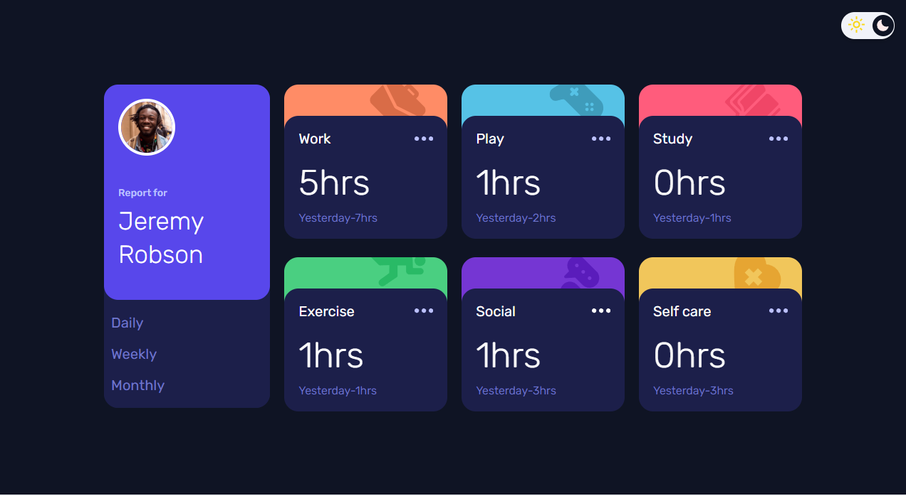
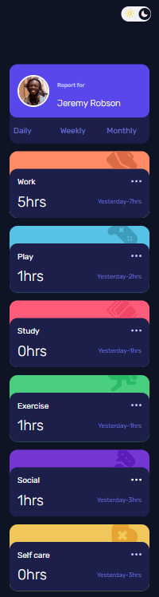

# Time tracking dashboard solution
This is a challenge for induction of Ragm Tech Team.this particular project is also a challenge posted in frontendmentor.io

Apart from the main challenge objectives,I ve also added a light mode and a toggle button to toggle from light and dark mode
Users can also Change the name 'JEREMY ROBSON' to their name just by clicking on the Avatar image and a register will pop up to read name.

## Table of contents

- [Overview](#overview)
  - [The challenge](#the-challenge)
  - [Screenshot](#screenshot)
  - [Links](#links)
  - [Useful resources](#useful-resources)
- [Author](#author)
- [Acknowledgments](#acknowledgments)

## Overview

### The challenge

Users should be able to:

- View the optimal layout for the site depending on their device's screen size
- See hover states for all interactive elements on the page
- Switch between viewing Daily, Weekly, and Monthly stats
- When user hovers over the the boxes, they will expand .
- Toggle between light / dark mode.
- Input their name by clicking on the image
### Screenshot

### Links

- Live Site URL: https://time-tracking-dashboard-g78l8wx4l-code-slams-projects.vercel.app/

### Built with

- HTML5 markup
- CSS 
- JS

### Useful resources

- https://www.youtube.com/watch?v=WTchW0LdWL0 i was completely new to webdev..so i started with this and towards the end i could do everything independently.
**

## Author

- Ameen-Aslam

## Acknowledgments

Frontendmentor-help
Coding in PuBLIC -YT channel
